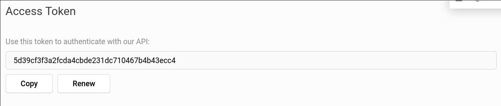
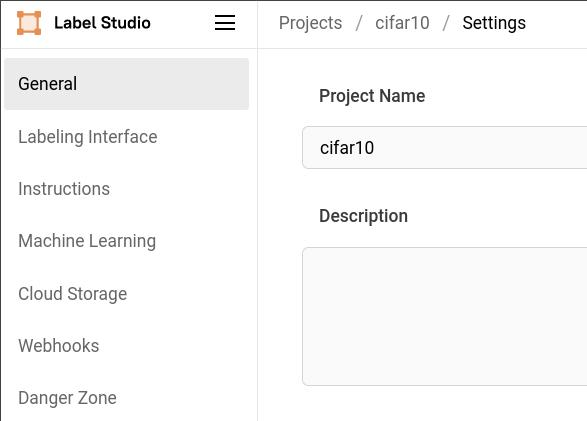
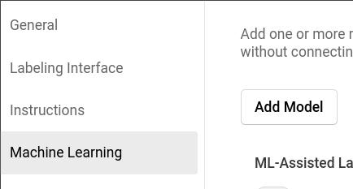
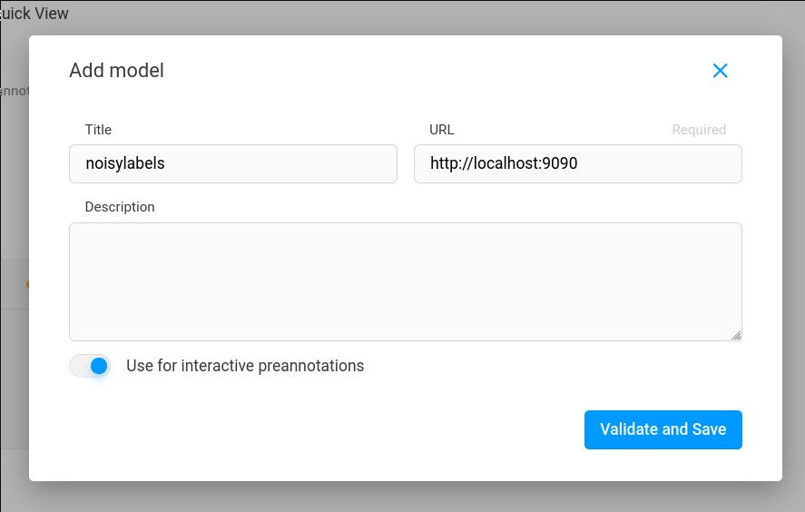

# NoisyLabels

NoisyLabels is a [Label Studio](https://labelstud.io) plugin for image classification tasks with two modes of operation:  
* Mode 1: Assisted-Labeling with tolerance for labeling errors,
* Mode 2: Label-Correction of a noisy dataset (e.g. scraped data).

## Prior Work

Based on the paper [InstanceGM: Instance-Dependent Noisy Label Learning via Graphical Modelling (IEEE/CVF WACV 2023 Round 1)](https://openaccess.thecvf.com/content/WACV2023/html/Garg_Instance-Dependent_Noisy_Label_Learning_via_Graphical_Modelling_WACV_2023_paper.html), also [on Arxiv](https://arxiv.org/abs/2209.00906).

<details><summary>Badges at the time of acceptance 2022</summary>

[](https://paperswithcode.com/sota/learning-with-noisy-labels-on-animal?p=instance-dependent-noisy-label-learning-via)

[](https://paperswithcode.com/sota/learning-with-noisy-labels-on-cifar-10?p=instance-dependent-noisy-label-learning-via)

[](https://paperswithcode.com/sota/learning-with-noisy-labels-on-cifar-100?p=instance-dependent-noisy-label-learning-via)

[](https://paperswithcode.com/sota/learning-with-noisy-labels-on-red?p=instance-dependent-noisy-label-learning-via)

[](https://paperswithcode.com/sota/image-classification-on-red-miniimagenet-40?p=instance-dependent-noisy-label-learning-via)

[](https://paperswithcode.com/sota/learning-with-noisy-labels-on-red-1?p=instance-dependent-noisy-label-learning-via)

[](https://paperswithcode.com/sota/image-classification-on-red-miniimagenet-60?p=instance-dependent-noisy-label-learning-via)

[](https://paperswithcode.com/sota/learning-with-noisy-labels-on-red-2?p=instance-dependent-noisy-label-learning-via)

[](https://paperswithcode.com/sota/image-classification-on-red-miniimagenet-80?p=instance-dependent-noisy-label-learning-via)

[](https://paperswithcode.com/sota/learning-with-noisy-labels-on-red-3?p=instance-dependent-noisy-label-learning-via)

[](https://paperswithcode.com/sota/image-classification-on-red-miniimagenet-20?p=instance-dependent-noisy-label-learning-via)

[](https://paperswithcode.com/sota/image-classification-on-clothing1m?p=instance-dependent-noisy-label-learning-via)
</details>

## Installation

We use [Docker](https://docs.docker.com/) to run Noisy Labels in a container.

First, you will need a [Label Studio](https://labelstud.io) installation. Noisy Labels has been tested with version 1.8.2. Login to Label Studio and note your API key (under Account and Settings):



Open `docker-compose.yml` and change `LABEL_STUDIO_HOST` to point at the address of your Label Studio installation; the default value assumes Label Studio is running on the same host as the docker container hosting Noisy Labels. Set `LABEL_STUDIO_API_KEY` to your API key.

Run `docker compose up --build` to start the Noisy Labels container.

Open the settings for a Label Studio project:



Go to `Machine Learning` and `Add Model`:



Fill in the details:



### Assisted labeling

Set the ML-assisted labeling options in Label Studio and Noisy Labels will now be invoked by Label Studio to

- train a model when new annotations are submitted
- pre-fill examples with model predictions so that annotators can just accept them when they are correct.

### Correcting noisy labels from existing dataset

Given an existing dataset defined by a simple folder structure like

```
dataset/
|- cat/
   |- image001.jpg
   |- image002.jpg
   |- ...
|- dog/
   |- image101.jpg
   |- image102.jpg
   |- ...
|- ...
```

A script is provided to import the dataset into Label Studio with the appropriate format.
First, create a virtualenv or conda environment, and install the dependencies:

```shell
conda create -p ./env python=3.9
conda activate ./env
pip install -r requirements.txt
```

To generate an example dataset, there is a script to create one:

```shell
python dataset_cats_and_dogs/cats_and_dogs_noisy.py
```

This will create a dataset of cats and dogs in `dataset_cats_and_dogs/intermediate/`.

Then run the import script, providing your Label Studio API key:

```shell
 LABEL_STUDIO_API_KEY="5d39cf3f3a2fcda4cbde231dc710467b4b43ecc4" python labelstudio_import.py --dataset path/to/dataset/ --title "Label Studio project title"
 ```

Once imported, navigate to the project in Label Studio and setup Noisy Labels as above. After the settings are saved, Label Studio should trigger Noisy Labels to train:

```shell
ml-backend  | [2024-02-04 23:06:08,794] [INFO] [root::fit::180] Using 10000 training images with 10000 labels
ml-backend  | [2024-02-04 23:06:08,794] [INFO] [root::fit::182] Train model...
Epochs:   0%|          | 0/25 [00:00<?, ?it/s][2024-02-04 23:06:56,956] [INFO] [root::main::460] Warmup Net1
Project Created from SDK: Noisy Dogs and Cats:0.5-instance | Epoch [  0/ 25] Iter[ 79/ 79]       CE-loss: 0.5515[2024-02-04 23:07:02,672] [INFO] [root::main::462] Warmup Net2
Project Created from SDK: Noisy Dogs and Cats:0.5-instance | Epoch [  0/ 25] Iter[ 79/ 79]       CE-loss: 0.6847[2024-02-04 23:07:08,600] [INFO] [root::test::267]
...
Epochs: 100%|██████████| 25/25 [38:17<00:00, 132.87s/it][2024-02-04 23:45:06,148] [INFO] [root::main::470] Train Net1
Project Created from SDK: Noisy Dogs and Cats:0.5-instance | Epoch [ 25/ 25] Iter[125/125]       Labeled loss: 0.70  Unlabeled loss: 0.04[2024-02-04 23:46:04,489] [INFO] [root::main::489] Train Net2
Project Created from SDK: Noisy Dogs and Cats:0.5-instance | Epoch [ 25/ 25] Iter[122/122]       Labeled loss: 0.53  Unlabeled loss: 0.04[2024-02-04 23:47:04,809] [INFO] [root::test::267]
ml-backend  | [2024-02-04 23:47:19,252] [INFO] [root::fit::196] New model version: Project Created from SDK: Noisy Dogs and Cats_2024-02-04_23:06:08
ml-backend  | [2024-02-04 23:47:19,252] [INFO] [root::fit::198] fit() completed successfully.
```

Corrections are now available in JSON format:

```shell
curl -O localhost:9090/corrections.json
```

Generate a corrected dataset, applying only corrections above a certain score threshold:

```shell
python correct_dataset.py --threshold 0.95 corrections.json path/to/original/dataset/ path/to/corrected/dataset/
```

## Licence

NoisyLabels is available for non-commercial internal research use by academic institutions or not-for-profit organisations only, free of charge. Please, see the [license](./license.txt) for further details. To the extent permitted by applicable law, your use is at your own risk and our liability is limited. Interested in a commercial license? For commercial queries, please email <aimlshop@adelaide.edu.au> with subject line "NoisyLabels Commercial License".


This is an [AIML Shop](https://aiml.shop) project.
